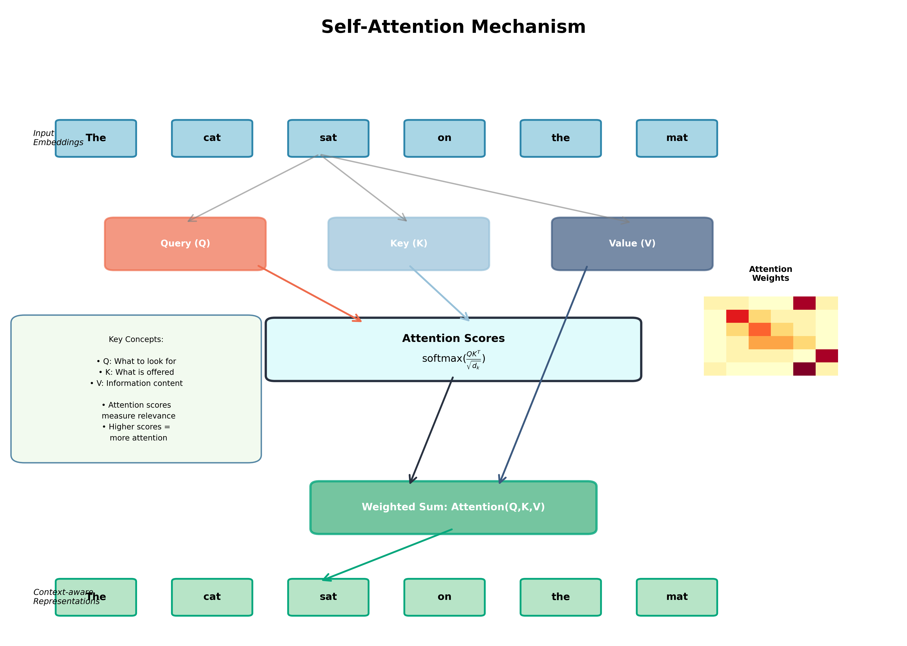
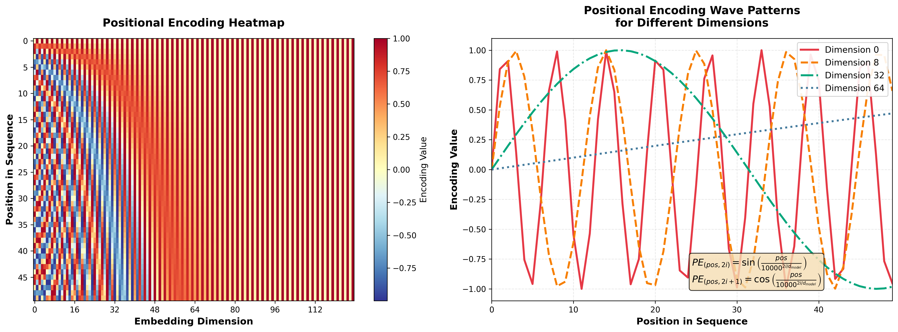

# Transformer Networks and Their Applications in Cybersecurity

## Introduction

The Transformer architecture, introduced in the seminal 2017 paper "Attention is All You Need" by Vaswani et al., revolutionized the field of deep learning by replacing recurrent and convolutional layers with a novel self-attention mechanism. This architecture has become the foundation for modern large language models and has found significant applications in cybersecurity.

## Core Architecture

### Self-Attention Mechanism

The self-attention mechanism is the heart of the transformer architecture. It allows the model to weigh the importance of different parts of the input sequence when processing each element. The mechanism computes three vectors for each input token:

- **Query (Q)**: What the token is looking for
- **Key (K)**: What the token represents
- **Value (V)**: The actual information to be aggregated

The attention score is calculated using the scaled dot-product attention formula:

```
Attention(Q, K, V) = softmax(QK^T / √d_k)V
```

Where `d_k` is the dimension of the key vectors, used for scaling to prevent extremely small gradients.



### Multi-Head Attention

Instead of performing a single attention function, transformers use multi-head attention, which runs multiple attention mechanisms in parallel. Each head learns to attend to different aspects of the input, capturing various types of relationships:

- Head 1 might focus on syntactic relationships
- Head 2 might capture semantic dependencies
- Head 3 might identify positional patterns

The outputs from all heads are concatenated and linearly transformed to produce the final output.

### Positional Encoding

Since transformers process all tokens in parallel (unlike RNNs which process sequentially), they need a way to inject information about token positions. Positional encoding adds position-specific patterns to the input embeddings using sine and cosine functions:

```
PE(pos, 2i) = sin(pos / 10000^(2i/d_model))
PE(pos, 2i+1) = cos(pos / 10000^(2i/d_model))
```

Where:
- `pos` is the position in the sequence
- `i` is the dimension index
- `d_model` is the embedding dimension



### Encoder-Decoder Structure

The original transformer consists of:

**Encoder**: Processes the input sequence through multiple layers of self-attention and feed-forward networks, building rich contextual representations.

**Decoder**: Generates the output sequence autoregressively, attending to both the previously generated tokens and the encoder's output.

## Applications in Cybersecurity

### 1. Malware Detection and Classification

Transformers excel at analyzing malware bytecode sequences and API call patterns:

- **Binary Code Analysis**: Treating binary code as sequences, transformers can identify malicious patterns by learning relationships between instruction sequences
- **Behavioral Analysis**: By processing system call sequences, transformers detect anomalous behavior indicative of malware
- **Zero-Day Detection**: The attention mechanism helps identify novel malware variants by focusing on subtle pattern deviations

### 2. Network Intrusion Detection Systems (NIDS)

Transformers enhance network security monitoring:

- **Packet Sequence Analysis**: Processing network packets as sequential data to identify attack patterns (DDoS, port scanning, SQL injection)
- **Anomaly Detection**: Learning normal traffic patterns and flagging deviations with high accuracy
- **Protocol Analysis**: Understanding complex protocol sequences to detect protocol-based attacks

### 3. Phishing and Spam Detection

Natural language processing capabilities make transformers ideal for:

- **Email Content Analysis**: Detecting phishing attempts through sophisticated language understanding
- **URL Analysis**: Identifying malicious URLs by analyzing character patterns and domain structures
- **Social Engineering Detection**: Recognizing manipulation tactics in messages and communications

### 4. Vulnerability Detection in Source Code

Code-aware transformers analyze source code to find security vulnerabilities:

- **Static Code Analysis**: Identifying buffer overflows, SQL injection vulnerabilities, and cross-site scripting (XSS) flaws
- **Code Clone Detection**: Finding reused vulnerable code patterns across codebases
- **Patch Analysis**: Understanding security patches to identify similar vulnerabilities elsewhere

### 5. Threat Intelligence and Log Analysis

Transformers process vast amounts of security logs:

- **SIEM Enhancement**: Analyzing security logs to correlate events and identify complex attack chains
- **Automated Threat Hunting**: Discovering indicators of compromise (IOCs) in large datasets
- **Incident Response**: Generating contextual summaries of security incidents for rapid response

### 6. Authentication and Access Control

Behavioral biometrics using transformers:

- **Keystroke Dynamics**: Analyzing typing patterns for continuous authentication
- **Mouse Movement Analysis**: Detecting unusual interaction patterns
- **User Behavior Analytics (UBA)**: Identifying compromised accounts through behavioral anomalies

### 7. Cryptanalysis and Secure Communication

Emerging applications include:

- **Traffic Analysis**: Identifying encrypted communication patterns
- **Side-Channel Attack Detection**: Analyzing timing and power consumption patterns
- **Adversarial Robustness**: Defending against adversarial attacks on ML models

## Advantages in Cybersecurity

### Superior Pattern Recognition

The self-attention mechanism allows transformers to:
- Capture long-range dependencies in data sequences
- Identify subtle correlations that traditional methods miss
- Adapt to evolving threat landscapes through transfer learning

### Scalability

Transformers can:
- Process massive datasets efficiently through parallelization
- Scale to handle enterprise-level security monitoring
- Leverage pre-training on general data and fine-tune for specific security tasks

### Contextual Understanding

Unlike traditional ML approaches:
- Transformers understand context holistically rather than in isolation
- The attention mechanism provides interpretability by showing what the model focuses on
- Multi-head attention captures multiple perspectives simultaneously

## Challenges and Considerations

### Computational Requirements

- Transformers require substantial computational resources (GPUs/TPUs)
- Memory complexity scales quadratically with sequence length (O(n²))
- Deployment in resource-constrained environments can be challenging

### Data Requirements

- Large amounts of labeled training data are needed
- Cybersecurity datasets often contain imbalanced classes
- Privacy concerns when training on sensitive security data

### Adversarial Attacks

- Transformers can be vulnerable to adversarial examples
- Attackers may craft inputs specifically designed to evade detection
- Robustness testing and adversarial training are essential

### Model Interpretability

- While attention weights provide some insight, full interpretability remains challenging
- Security analysts need to trust and understand model decisions
- Explainable AI techniques are crucial for adoption

## Future Directions

### Efficient Architectures

Research into efficient transformer variants:
- Linear transformers reducing complexity to O(n)
- Sparse attention mechanisms
- Knowledge distillation for model compression

### Federated Learning

- Training transformers on distributed security data without centralizing sensitive information
- Privacy-preserving collaborative threat intelligence

### Multimodal Security

- Combining network traffic, logs, and binary analysis in unified transformer models
- Cross-domain threat detection

### Automated Security Operations

- Transformer-powered security orchestration, automation, and response (SOAR)
- Natural language interfaces for security analysts
- Automated incident report generation

## Conclusion

Transformer networks represent a paradigm shift in cybersecurity applications, offering unprecedented capabilities in pattern recognition, contextual understanding, and scalability. From malware detection to threat intelligence, transformers are enhancing security operations across multiple domains. As the architecture continues to evolve with more efficient variants and specialized adaptations, transformers will play an increasingly central role in defending against sophisticated cyber threats. However, successful deployment requires careful consideration of computational costs, data requirements, and adversarial robustness to maximize their potential in protecting digital assets.

The combination of powerful attention mechanisms, parallel processing capabilities, and transfer learning makes transformers an invaluable tool in the modern cybersecurity arsenal, enabling security teams to stay ahead of rapidly evolving threats in an increasingly complex digital landscape.

