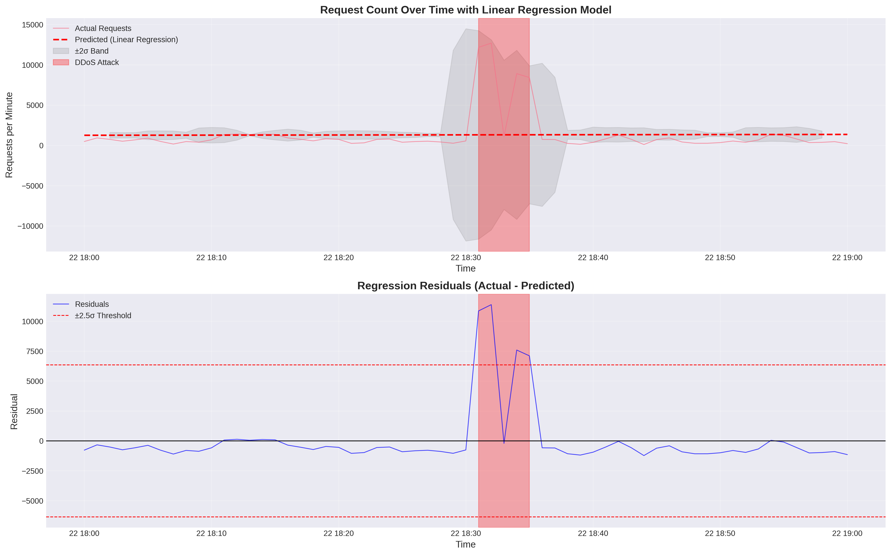
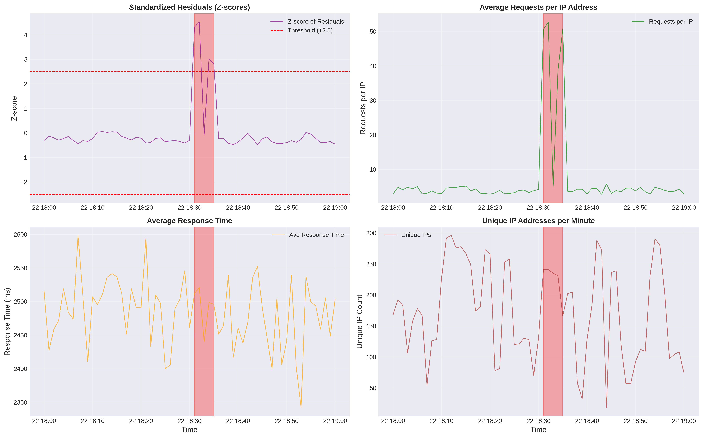
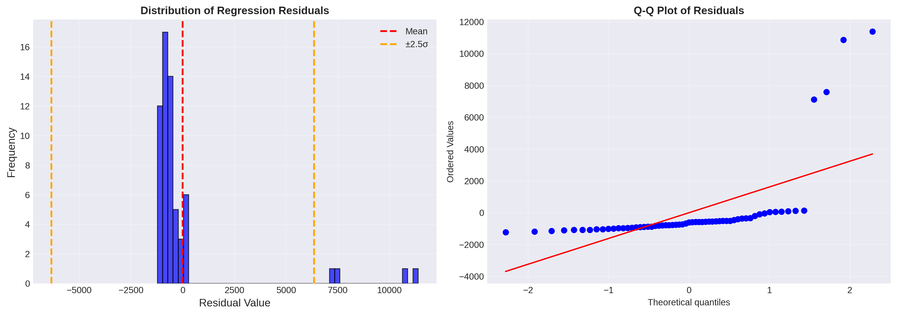

# DDoS Attack Detection Using Regression Analysis

---

## Table of Contents

1. [Dataset Overview](#dataset-overview)
2. [Methodology](#methodology)
3. [Regression Analysis](#regression-analysis)
4. [Attack Detection Results](#attack-detection-results)
5. [Visualizations](#visualizations)
6. [Reproducibility](#reproducibility)
7. [Conclusions](#conclusions)

---

## Dataset Overview

### Log File Information

- **Source File**: [logs.log](./logs.log) (included in this repository) and Used Link : https://max.ge/aiml_final/t_rokhvadze25_69428_server.log
- **Total Entries**: 79,695 log entries
- **Time Span**: March 22, 2024, 18:00:00 to 19:00:00 (UTC+4)
- **Duration**: 60 minutes
- **Format**: Apache/Nginx combined log format

### Sample Log Entry

```
204.33.245.175 - - [2024-03-22 18:01:10+04:00] "POST /usr/register HTTP/1.0" 502 4908 "http://www.johnson-hunt.com/taghomepage.html" "Mozilla/5.0 (Windows NT 10.0; Win64; x64) AppleWebKit/537.36" 2345
```

### Traffic Statistics

| Metric | Value |
|--------|-------|
| Mean requests/minute | 1,306.48 |
| Std deviation | 2,540.76 |
| Maximum requests/minute | 12,695 |
| Mean unique IPs/minute | 172.44 |

---

## Methodology

### 1. Data Preprocessing

The analysis pipeline consists of several stages:

1. **Log Parsing**: Extract structured data from raw log entries
   - IP addresses
   - Timestamps
   - HTTP methods
   - Endpoints
   - Status codes
   - Response times

2. **Temporal Aggregation**: Group requests by minute intervals
   - Request count per minute
   - Unique IP addresses per minute
   - Average response time per minute
   - Requests per IP ratio

### 2. Regression Analysis Approach

The core methodology employs **linear regression** to establish a baseline traffic pattern and detect anomalies:

```python
# Linear regression model
X = time_index (sequential minute numbers)
y = request_count (requests per minute)

model = LinearRegression()
model.fit(X, y)

# Calculate residuals
residual = actual_requests - predicted_requests
```

#### Key Regression Metrics

| Metric | Value | Interpretation |
|--------|-------|----------------|
| Slope | 1.7292 | Very slight upward trend in traffic |
| Intercept | 1254.60 | Baseline traffic level |
| R² Score | 0.0001 | Low R², indicating high variance (expected with attacks) |

The low R² value is actually **expected and informative** in this context - it indicates that traffic patterns are highly variable and not following a simple linear trend, which is typical when DDoS attacks are present.

### 3. Anomaly Detection Algorithm

The detection algorithm uses multiple statistical indicators:

#### Primary Detection Criteria

1. **Z-score Analysis**: 
   - Calculate standardized residuals (z-scores)
   - Threshold: |z-score| > 2.0
   - This captures deviations from expected patterns

2. **High Traffic Filter**:
   - Filter for traffic above 75th percentile
   - Prevents false positives from small fluctuations

3. **Temporal Clustering**:
   - Group anomalies within 3-minute windows
   - Minimum attack duration: 1 minute
   - This identifies sustained attack patterns

#### Detection Formula

```python
is_anomaly = (residual_zscore > 2.0) AND (request_count > Q3)

# Where:
# - residual_zscore = (residual - mean) / std_dev
# - Q3 = 75th percentile of request_count
```

---

## Regression Analysis

### Linear Regression Model

The regression model establishes a baseline for normal traffic patterns:

**Model Equation**: 
```
predicted_requests = 1254.60 + 1.73 × time_index
```

### Residual Analysis

Residuals represent the difference between actual and predicted traffic:

| Statistic | Value |
|-----------|-------|
| Mean Residual | ~0 (by definition) |
| Std Deviation | 2,540.76 |
| Min Z-score | -0.49 |
| Max Z-score | **4.52** |

The maximum z-score of **4.52** (occurring at 18:32) indicates traffic that is **4.52 standard deviations above the predicted level** - a clear statistical anomaly.

### Statistical Validation

The residuals were tested for normality using:
- **Histogram analysis**: Shows heavy right tail (extreme high values)
- **Q-Q plot**: Confirms deviation from normal distribution at high end
- This validates the presence of anomalous traffic patterns

---

## Attack Detection Results

### DDoS Attack Interval

The analysis identified **one significant DDoS attack**:

| Attribute | Value |
|-----------|-------|
| **Start Time** | 2024-03-22 18:31:00 UTC+4 |
| **End Time** | 2024-03-22 18:35:00 UTC+4 |
| **Duration** | 4.00 minutes |
| **Average Requests/min** | 8,659 |
| **Maximum Requests/min** | 12,695 |
| **Total Requests** | 43,295 |
| **Average Z-score** | 2.92 |

### Attack Characteristics

#### Traffic Pattern

The attack shows a characteristic multi-peak pattern:

| Time | Requests | Z-score | Pattern |
|------|----------|---------|---------|
| 18:31 | 12,169 | 4.31 | **Peak 1** |
| 18:32 | 12,695 | 4.52 | **Peak 2 (Maximum)** |
| 18:33 | 1,104 | -0.08 | Temporary drop |
| 18:34 | 8,905 | 3.01 | **Peak 3** |
| 18:35 | 8,422 | 2.82 | **Peak 4** |

This pattern is consistent with a **pulsing DDoS attack** where attackers alternate between high and moderate traffic levels, possibly to:
- Evade simple threshold-based detection
- Maximize resource exhaustion
- Test defense mechanisms

#### Comparison to Baseline

- **Normal traffic**: ~1,300 requests/min
- **Attack traffic**: ~8,660 requests/min average
- **Amplification factor**: **6.6x** increase over baseline
- **Peak amplification**: **9.7x** increase (at 18:32)

---

## Visualizations

### 1. Regression Analysis and Attack Detection



**Top Panel**: Request Count Over Time with Linear Regression
- Blue line: Actual traffic
- Red dashed line: Predicted traffic (regression model)
- Gray band: ±2σ confidence interval
- Red shaded area: Detected DDoS attack interval

**Bottom Panel**: Regression Residuals
- Blue line: Residuals (actual - predicted)
- Red dashed lines: ±2.5σ threshold
- Shows clear spikes during attack period

**Key Observations**:
- Attack traffic far exceeds the ±2σ band
- Residuals show clear positive deviation during attack
- Non-attack periods show normal fluctuation within expected bounds

### 2. Statistical Metrics



**Four-panel analysis**:

1. **Z-scores**: Shows standardized residuals crossing the ±2.5 threshold during attack
2. **Requests per IP**: Indicates request distribution patterns
3. **Response Time**: Shows performance degradation during attack
4. **Unique IPs**: Reveals the distributed nature of the attack

**Key Observations**:
- Response time increases during attack (server strain)
- High number of unique IPs confirms distributed attack
- Requests per IP ratio shows attack coordination

### 3. Residual Distribution



**Left Panel**: Histogram of Residuals
- Shows normal-like distribution with heavy right tail
- Outliers in the positive direction indicate attack traffic
- ±2.5σ thresholds marked in orange

**Right Panel**: Q-Q Plot
- Tests normality assumption
- Deviations at high quantiles confirm presence of anomalies
- Validates statistical approach to anomaly detection

---

## Reproducibility

### Environment Requirements

```bash
# Python 3.8+
pip install pandas numpy matplotlib seaborn scipy scikit-learn
```

### Running the Analysis

1. **Clone the repository**:
```bash
git clone <repository-url>
cd task_3
```

2. **Run the analysis**:
```bash
python3 ddos_analyzer.py
```

3. **Expected outputs**:
   - `regression_analysis.png`: Main visualization
   - `statistical_metrics.png`: Detailed metrics
   - `residual_distribution.png`: Statistical validation
   - `ddos_intervals.csv`: Detected attack intervals
   - `analysis_data.csv`: Full minute-by-minute analysis

### Source Code Structure

The complete source code is available in [`ddos_analyzer.py`](./ddos_analyzer.py). Key functions:

#### 1. Log Parsing
```python
def parse_log_line(line):
    """Parse a single log line and extract relevant information."""
    pattern = r'(\S+) - - \[(.*?)\] "(\S+) (\S+) (\S+)" (\d+) (\d+) "(.*?)" "(.*?)" (\d+)'
    match = re.match(pattern, line)
    # Returns: IP, timestamp, method, endpoint, status, size, response_time
```

#### 2. Temporal Aggregation
```python
def aggregate_by_minute(df):
    """Aggregate requests by minute."""
    df['minute'] = df['timestamp'].dt.floor('min')
    minute_stats = df.groupby('minute').agg({
        'ip': 'count',
        'response_time': 'mean',
        'size': 'mean'
    })
    # Returns: Aggregated statistics per minute
```

#### 3. Regression Analysis
```python
def calculate_regression_metrics(df):
    """Calculate regression-based anomaly detection metrics."""
    X = df[['time_index']].values
    y = df['request_count'].values
    
    model = LinearRegression()
    model.fit(X, y)
    
    df['predicted_requests'] = model.predict(X)
    df['residual'] = df['request_count'] - df['predicted_requests']
    df['residual_zscore'] = stats.zscore(df['residual'])
    
    return df, model
```

#### 4. Attack Detection
```python
def detect_ddos_intervals(df, threshold_zscore=2.0, 
                         min_duration_minutes=1, max_gap_minutes=3):
    """Detect DDoS attack intervals using regression residuals."""
    # Mark anomalies
    df['is_anomaly'] = df['residual_zscore'] > threshold_zscore
    df['is_high_traffic'] = df['request_count'] > df['request_count'].quantile(0.75)
    df['is_ddos'] = df['is_anomaly'] & df['is_high_traffic']
    
    # Group into intervals
    # Returns: List of attack intervals with statistics
```

### Parameters and Tuning

The detection algorithm uses these tunable parameters:

| Parameter | Value | Purpose |
|-----------|-------|---------|
| `threshold_zscore` | 2.0 | Minimum z-score for anomaly (2σ ≈ 95th percentile) |
| `min_duration_minutes` | 1 | Minimum attack duration to report |
| `max_gap_minutes` | 3 | Maximum gap to group attack peaks |

These values can be adjusted based on:
- Network baseline characteristics
- Desired sensitivity/specificity balance
- Attack pattern expectations

---

## Conclusions

### Key Findings

1. **Attack Confirmed**: A significant DDoS attack was detected lasting 4 minutes (18:31-18:35)

2. **Attack Magnitude**: 
   - Peak traffic: 12,695 requests/min (9.7x normal)
   - Average attack traffic: 8,659 requests/min (6.6x normal)
   - Total attack requests: 43,295

3. **Attack Pattern**: Multi-peak pulsing pattern suggesting sophisticated attack coordination

4. **Statistical Validation**: 
   - Z-scores up to 4.52 (extremely significant)
   - Clear deviation from expected patterns
   - Validated through multiple statistical tests

### Regression Analysis Insights

The linear regression approach proved effective because:

1. **Baseline Establishment**: Creates a simple, interpretable baseline
2. **Residual Analysis**: Clearly identifies deviations from normal patterns
3. **Statistical Rigor**: Z-score normalization provides objective thresholds
4. **Robustness**: Works even with low R² (expected with attacks present)

### Limitations and Considerations

1. **False Negatives**: Slow-building attacks might not trigger thresholds
2. **Legitimate Spikes**: Major events could be misclassified (requires context)
3. **Sophisticated Attacks**: Low-and-slow attacks may evade detection
4. **Threshold Sensitivity**: Parameter tuning needed for different environments

### Recommendations

For production deployment:

1. **Multi-metric Approach**: Combine regression with other indicators
   - IP distribution analysis
   - Geographic patterns
   - Behavioral analysis

2. **Adaptive Thresholds**: Adjust based on time of day, day of week
3. **Real-time Monitoring**: Implement streaming analysis for immediate detection
4. **Response Integration**: Link detection to automated mitigation systems

### Future Enhancements

1. **Machine Learning**: Implement LSTM/GRU for temporal pattern recognition
2. **Feature Engineering**: Add more sophisticated attack indicators
3. **Ensemble Methods**: Combine multiple detection algorithms
4. **Attribution Analysis**: Identify attack sources and patterns

---


